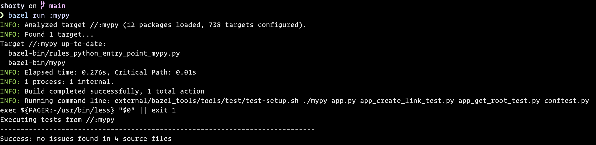
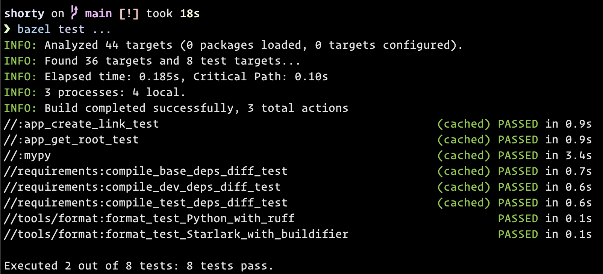

# Shorty: a minimal link shortener

...and also a place to demonstrate
modern Python software development with Bazel.

Any client can:
* Create a new short link
* Visit an existing short link to be redirected to its target

See [notes](#notes).


This app works best when running on an intranet with DNS set up so users can just type
`go/` in their browsers to access this service. Short links then end up looking like:
[go/my-short-link](https://go/my-short-link)


# Features

This project demonstrates:

* Hermetically building, running, testing, type checking, linting, and auto-formatting
  a Python codebase, as well as measuring code coverage,
  using modern, idiomatic Python and Bazel workflows.

* Bazel managing native Python virtual environments
  and installing Python package dependencies (wheels or sdists from PyPI)
  in them automatically, in a reproducible, fast, and cache-friendly fashion.

  * [uv](https://docs.astral.sh/uv/) is used via [rules_uv](https://github.com/theoremlp/rules_uv)
    to make environment creation, dependency resolution, and installation 100x faster
    than with pip/pip-tools (currently used by rules_python and aspect's rules_py;
    [rules_python is working toward uv support](https://github.com/bazelbuild/rules_python/issues/1975)).

* VSCode configuration to enable e.g.
  discovering the Python environment that Bazel manages
  (so you can "go to definition", see usage errors, etc. across third-party imports),
  discovering tests and running them via VSCode's "Testing" UI,
  and using the VSCode Python debugger, out-of-the-box.

* Using `pytest` via Bazel, with associated VSCode integration,
  for an idiomatic Python testing experience.

* Using Bazel to hermetically fetch and drive
  [ruff](https://docs.astral.sh/ruff/) for linting and formatting Python code,
  [buildifier](https://github.com/bazelbuild/buildtools/blob/master/buildifier/README.md)
  for formatting Starlark,
  and mypy for type checking.
  (TODO: try the new [rules_mypy](https://github.com/theoremlp/rules_mypy))

* Building an efficient [container](./container) image for a Python application via
  [rules_oci](https://github.com/bazel-contrib/rules_oci/blob/main/docs/python.md).


## Quick start

Run the app:
```
bazel run :app
```

You should see something like
```
Running on http://0.0.0.0:8675 (CTRL + C to quit)
```
toward the end of the output, and you can then point your browser
at a corresponding address to try the app.


## Type checking

```
bazel run :mypy
```



## Running the tests

```
bazel test ...
```



## Measuring test coverage

```
bazel coverage ...
```

In the output, Bazel should mention the path `bazel-out/_coverage/_coverage_report.dat`.
You can pass this to `genhtml` (commonly provided by the `lcov` package)
to generate an html report from this coverage data.
See [bazel's coverage docs](https://bazel.build/configure/coverage) for more info.


## Interactive development

To watch the code for changes and reload changed files automatically while you're developing,
you can use [bazel-watcher](https://github.com/bazelbuild/bazel-watcher).
Just replace `bazel` with `tools/ibazel`.

Examples:
* `tools/ibazel run :app.dev`
* `tools/ibazel test ...`

Better yet, just open this project in VSCode. It's configured to automatically start
the Flask dev server (with the debugger enabled) upon opening this project,
using ibazel to watch for changes.


## VSCode Debugger Integration

Search for "Demo how to use VSCode's Python debugger" in `app.py`,
follow the instructions in the comment, and uncomment out the associated code.


## Linting and code formatting

Linting and code formatting are provided via
[rules_lint](https://github.com/aspect-build/rules_lint)
(and made more ergonomic via [aspect-cli](https://github.com/aspect-build/aspect-cli)).

Examples:
* `bazel run //tools/format:format`
* `aspect lint :app`
* `aspect lint :all`


This can be set up as a pre-commit hook
and as a PR merge check if desired.


## Taking additional dependencies

To take additional runtime dependencies,
add them to `requirements/base.in`, then run:
```
bazel run //requirements:compile_base_deps
```

This re-compiles `requirements/base.txt` (a standard pip requirements lock file)
based on your changed `requirements/base.in`.
See the [pip-tools docs](https://pip-tools.readthedocs.io) if this is new to you.

The process of updating test- and dev-time dependencies is similar,
except using the corresponding requirements files and targets instead of `base`.


## Build and run a container image

1. Build the image: `bazel build //container:oci_image`

1. Load it into podman: `podman load -i bazel-bin/container/oci_image`

   This should output something like the following at the end:
   ```
   Loaded image: sha256:2eb15062c3199b82e92a53d3cb9b1da93d26176c9d7c02788a68356957aaa51c
   ```

1. Run it: `podman run --publish=8675:8675 2eb1`
   (replace 28b1 with whatever sha was output by the previous step)

1. You should now be able to access the server running inside the container:
   `curl localhost:8675`


## Notes

* The production-quality server used is [hypercorn](https://hypercorn.rtfd.io).
  You can access its CLI via `bazel run :hypercorn`,
  passing any desired arguments after a `--`, e.g.
  ```
  bazel run :hypercorn -- 'app:create_app()'
  ```
  See the [hypercorn docs](https://hypercorn.readthedocs.io/en/latest/how_to_guides/configuring.html#configuration-options)
  for other settings you may wish to change,
  e.g., to configure TLS, customize logging, etc.

* Exposing click-tracking metrics is a non-goal.

  This app is deliberately very minimal (~50 lines of code).

* Short links cannot be modified or deleted once created
  (unless you access the database directly).

* No authentication is performed.

  As always, it is the responsibility of the service hosting a target URL
  to perform any authentication and authorization required to access the requested resource.

  If you need to add authentication to this service, do either of the following:

  * Run a reverse proxy that authenticates all requests before forwarding them
    to this service, and make that the only way to reach this service.
    You probably want the reverse proxy to force HTTPS while you're at it. OR:

  * Modify `app.py` to wrap `app.wsgi_app` in appropriate auth middleware
    that performs authentication at the WSGI layer.
    Don't forget to [take the additional dependencies](#taking-additional-dependencies).

* By default, a SQLite database will be created in `/tmp/shorty.db` to persist the data.
  To customize this, set the `SQLITE_DB_URI` environment variable
  to the [SQLite database URI](https://docs.python.org/3/library/sqlite3.html#sqlite3-uri-tricks)
  you desire before running the app:

  ```
  export SQLITE_DB_URI="file:path/to/shorty.db"  # or...
  export SQLITE_DB_URI="file:memory?mode=memory&cache=shared"
  ```
