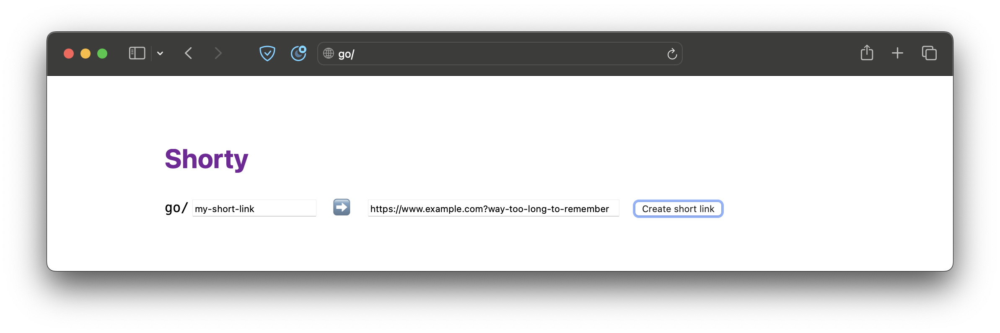
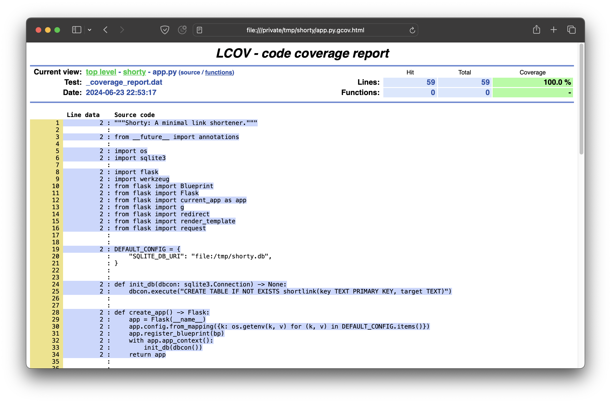

# Shorty: a minimal link shortener

...and also a place to demonstrate
modern Python software development with Bazel.

Any client can:
* Create a new short link
* Visit an existing short link to be redirected to its target

See [notes](#notes).



This app works best when running on an intranet with DNS set up so users can just type
`go/` in their browsers to access this service. Short links then end up looking like:
[go/my-short-link](https://go/my-short-link)


This project currently demonstrates:

* Hermetically building, running, and testing a Python app, as well as measuring code coverage.

* Using [aspect_rules_py](https://github.com/aspect-build/rules_py),
  so that e.g. VSCode can pick up the app's Python environment automatically
  (once it's been created, e.g. via `bazel run :app`)

* Using [rules_uv](https://github.com/theoremlp/rules_uv)
  to compile requirements lock files extremely quickly.

* Using [ruff](https://docs.astral.sh/ruff/) for linting and formatting Python code
  and [buildifier](https://github.com/bazelbuild/buildtools/blob/master/buildifier/README.md)
  for formatting starlark,
  via [aspect_rules_lint](https://github.com/aspect-build/rules_py).

* Building an efficient container image for a Python application via
  [rules_oci](https://github.com/bazel-contrib/rules_oci/blob/main/docs/python.md)
  (confirmed with [dive](https://github.com/wagoodman/dive)).

* Better `bazel` ergonomics via [Aspect CLI](https://docs.aspect.build/cli/).

  Tip: make a symlink from e.g. ~/bin/bazel to a new enough
  [bazelisk](https://github.com/bazelbuild/bazelisk).


## Quick start

Run the app:
```
bazel run :app
```

You should see something like
```
Running on http://0.0.0.0:... (CTRL + C to quit)
```
toward the end of the output, and you can then point your browser
at a corresponding address to try the app.


## Running the tests

```
bazel test :test_app
```


## Measuring test coverage

```
bazel coverage :test_app
```

Toward the end of the output, Bazel should print a path ending in coverage.dat.
You can pass this to `genhtml` (commonly provided by the `lcov` package)
to generate an html report from this coverage data.
See [bazel's coverage docs](https://bazel.build/configure/coverage) for more info.




## Interactive development

To watch the code for changes and reload changed files automatically while you're developing,
you can use [bazel-watcher](https://github.com/bazelbuild/bazel-watcher).
Just replace `bazel` with `ibazel`.

Examples:
* `ibazel run :app`
* `ibazel test :test_app`


## Linting and code formatting

Linting and code formatting are provided via
[rules_lint](https://github.com/aspect-build/rules_lint)
(and made more ergonomic via [aspect-cli](https://github.com/aspect-build/aspect-cli)).

Examples:
* `bazel lint :app`
* `bazel lint :all`
* `bazel run //tools/format:format`


This can be set up as a pre-commit hook
and as a PR merge check if desired.


## Taking additional dependencies

To take additional dependencies, add them to `requirements.base.in`, then run:
```
bazel run :compile_base_requirements
```

This re-compiles `requirements.base.txt` (a standard pip requirements lock file)
based on your changed `requirements.base.in`.
See the [pip-tools docs](https://pip-tools.readthedocs.io) if this is new to you.


## Build and run a container image

1. Build the image: `bazel build :oci_image`

1. Load it into podman: `podman load -i bazel-bin/oci_image`

   This should output something like the following at the end:
   ```
   Loaded image: sha256:2eb15062c3199b82e92a53d3cb9b1da93d26176c9d7c02788a68356957aaa51c
   ```

1. Run it: `podman run 2eb1506`  (or whatever sha was output by the previous step)


## Notes

* The production-quality server used is [hypercorn](https://hypercorn.rtfd.io).
  You can access its CLI via `bazel run :hypercorn`,
  passing any desired arguments after a `--`, e.g.
  ```
  bazel run :hypercorn -- --bind :0 app:app
  ```
  See the [hypercorn docs](https://hypercorn.readthedocs.io/en/latest/how_to_guides/configuring.html#configuration-options)
  for other settings you may wish to change,
  e.g., to configure TLS, customize logging, etc.

* Exposing click-tracking metrics is a non-goal.

  This app is deliberately very minimal (~50 lines of code).

* Short links cannot be modified or deleted once created
  (unless you access the database directly).

* No authentication is performed.

  As always, it is the responsibility of the service hosting a target URL
  to perform any authentication and authorization required to access the requested resource.

  If you need to add authentication to this service, do either of the following:

  * Run a reverse proxy that authenticates all requests before forwarding them
    to this service, and make that the only way to reach this service.
    You probably want the reverse proxy to force HTTPS while you're at it. OR:

  * Modify `app.py` to wrap `app.wsgi_app` in appropriate auth middleware
    that performs authentication at the WSGI layer
    (e.g., [wsgi-kerberos](https://github.com/deshaw/wsgi-kerberos)).
    Don't forget to [take the additional dependencies](#taking-additional-dependencies).

* By default, a SQLite database will be created in `/tmp/shorty.db` to persist the data.
  To customize this, set the `SQLALCHEMY_DATABASE_URI` environment variable
  to the database connection string you desire before running the app:

  ```
  export SQLALCHEMY_DATABASE_URI="sqlite:////path/to/shorty.db"
  ```

  To use a database other than SQLite, set the connection string appropriately
  (e.g., `postgres:///...`), and then
  [take the additional dependencies](#taking-additional-dependencies) (e.g., `psycopg`) as necessary.
  See the [sqlalchemy docs](https://docs.sqlalchemy.org/en/20/core/engines.html)
  if this is new to you.
